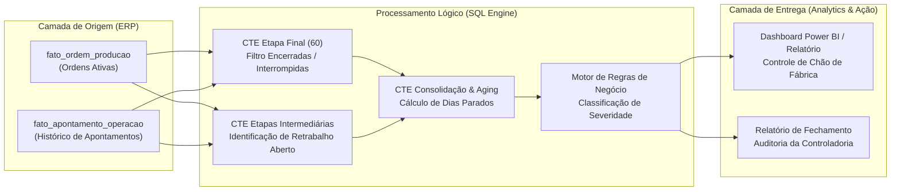

# Auditoria de Ordens de Produção & Integridade Contábil (WIP vs. PA)

📌 O Desafio de Negócio
Em plantas industriais com roteiros complexos de manufatura, ordens de produção frequentemente sofrem desvios de processo para retrabalho técnico. Uma inconsistência sistêmica comum no ERP ocorre quando a última operação fabril (Etapa 60 - Embalagem/Finalização) é encerrada ou interrompida, mas etapas intermediárias de retrabalho permanecem com status aberto.

Essa divergência gera um risco contábil e financeiro crítico: a ordem permanece com o status global de "Em Produção", mantendo saldo alocado em Estoque em Processo (**WIP - Work in Process**), ao mesmo tempo em que a etapa final já deu entrada física no Estoque de Produto Acabado (**PA**). O resultado direto é a duplicidade de inventário no fechamento mensal, distorção de balanço patrimonial e geração de retrabalho investigativo para a controladoria contábil.

🎯 O Objetivo
* Identificar em tempo real ordens de produção ativas com conflito de encerramento entre a etapa final e operações anteriores.
* Eliminar a distorção contábil de duplicidade de estoque (WIP e PA) antes da rotina de fechamento mensal.
* Monitorar o *aging* (tempo de parada) de ordens interrompidas com menos de 90% de volume concluído.
* Fornecer ao PCP (Planejamento e Controle de Produção) e à Controladoria uma lista acionável de regularização de apontamentos no chão de fábrica.

📐 Arquitetura do Fluxo de Dados

🛠️ A Solução Técnica

Modularização via Common Table Expressions (CTEs): A query foi estruturada em pipelines de dependência lógica, isolando o universo de ordens ativas, a etapa final e as etapas divergentes de forma legível e de fácil manutenção.

Resolução de Conflitos N:1 via Inner Joins Direcionados: Ao cruzar apenas a etapa final com ordens que continham etapas abertas concomitantes, o script elimina full scans desnecessários e evita produtos cartesianos comuns em bancos transacionais de manufatura.

Segurança Aritmética: Tratamento de divisão por zero via NULLIF(ord.qt_planejada, 0) no cálculo percentual de produção concluída.

Matriz de Regras Condicionais com Aging: Aplicação de lógica condicional aninhada baseada no cálculo delta de dias (SYSDATE - dt_fim) e taxa de entrega física para segmentar ordens em Revisar Interrupção, Ok e Avaliar.

🚀 Impacto Esperado (ou Real)

Prevenção de Erros de Balanço: Mitigação de 100% dos lançamentos contábeis duplicados decorrentes de ordens de retrabalho esquecidas no fechamento mensal.

Redução no SLA de Fechamento Contábil: Eliminação de horas gastas pela controladoria em conciliações manuais em planilhas ao final de cada mês.

Aumento da Visibilidade Fabril: Visibilidade imediata de ordens estagnadas há mais de 12 dias no chão de fábrica, permitindo ações corretivas do PCP antes da perda de prazo de entrega.
